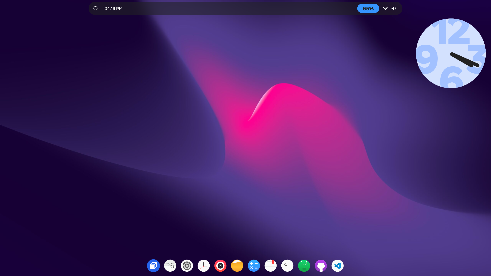
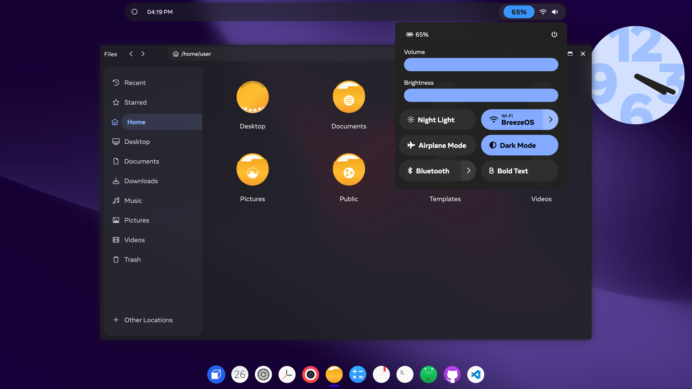

# BreezeOS

Welcome to BreezeOS, this is an open-source project generated using ReactJS and SASS. It was created by the Baodai government, which is not an actual government.

# Gallery

# Contributors

## **This project is still in development. Feel free to fork if you'd like to improve things in this project.**

## [Live Demo](https://baodaigov.github.io/BreezeOS) (fullscreen for full experience).